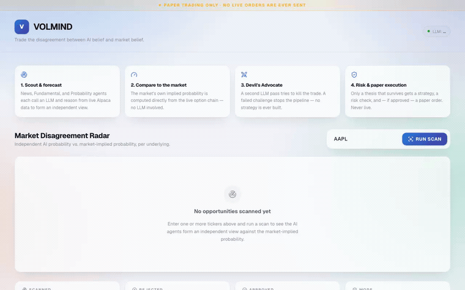
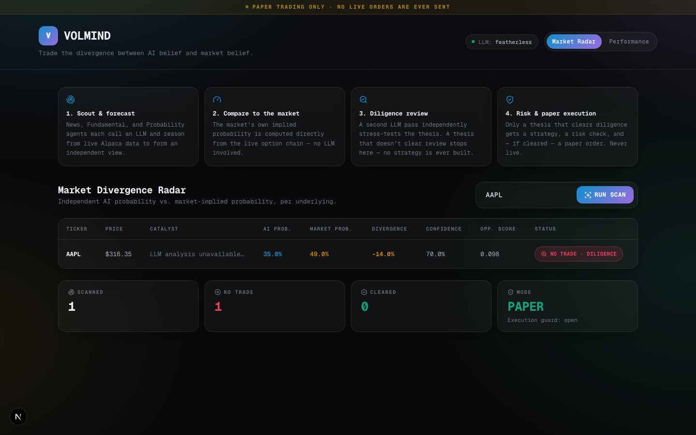
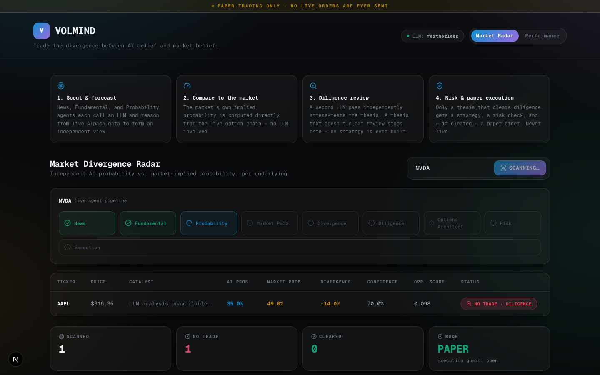
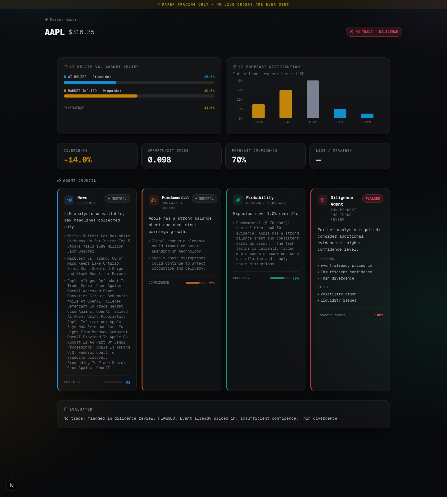
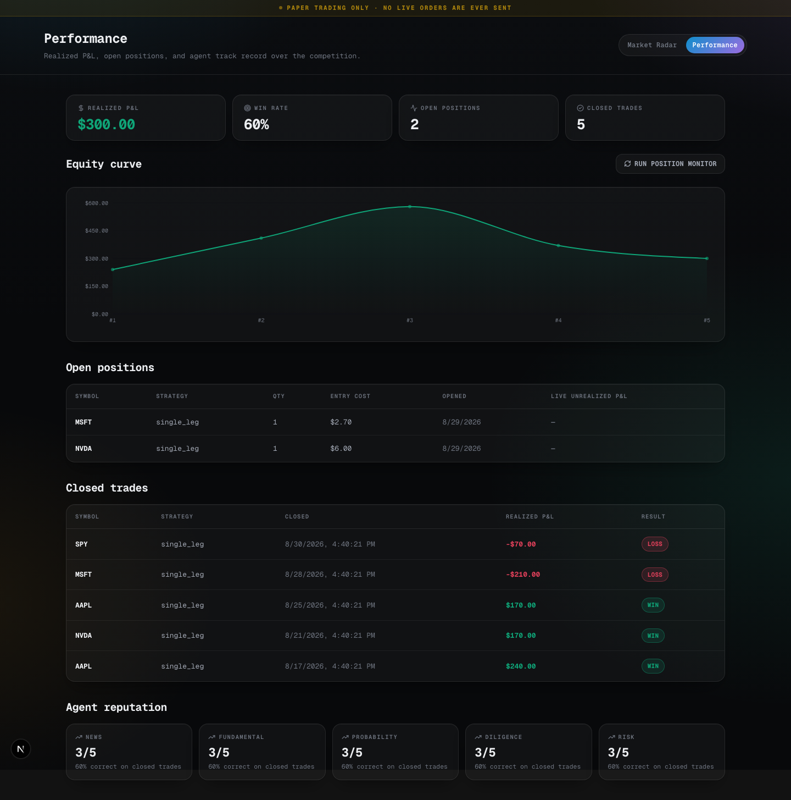

# VOLMIND

**Trade the divergence between AI belief and market belief.**

A multi-agent, autonomous options research and trading terminal built on Alpaca. A LangGraph
pipeline of specialized agents scouts opportunities, forms an independent probability estimate,
compares it against the market-implied probability from options pricing, puts the resulting
thesis through an independent diligence review, and routes only cleared theses through risk
checks before (paper) execution — then keeps watching every open position and closes it on a
take-profit, stop-loss, or expiry rule, so P&L is realized without a human in the loop. Left
running (`VOLMIND_AUTONOMOUS_MODE=true` or `scripts/run_autonomous.py`), it scans its watchlist
and manages its book on its own for the length of a competition.

Built for the hackathon as a fully autonomous agent, but the pipeline underneath is really a
**decision-support terminal**: a per-ticker feed of AI conviction vs. market-implied pricing,
an auditable diligence trail, and a risk gate — the same shape as the pre-trade research and
risk workflows built into a Bloomberg-style terminal, just running on an open pipeline instead
of a closed one. Point the same agent graph at a `/scan` call a human triggers instead of a
scheduler, drop the auto-execution step, and it's a research-and-alert tool a desk can run
alongside its existing terminal rather than a bot trading a book unattended — the autonomous
loop here is one deployment mode of that same underlying system, not the only one.

**Technical brief:** [`docs/TECHNICAL_BRIEF.md`](docs/TECHNICAL_BRIEF.md) — a one-page
write-up of the AI logic, risk gates, and Alpaca infrastructure for the hackathon
submission.

## Demo



A real, unedited run: News, Fundamental, and Probability agents each call an LLM and reason
from live Alpaca market/news data, the Diligence Agent reviews the resulting thesis, and the
pipeline halts before ever proposing a trade because the thesis didn't clear review. Full-length
video: [`docs/demo.mp4`](docs/demo.mp4).

> This recording pre-dates the Diligence Agent rename, automatic execution, and position
> management — it shows the pipeline through what was then called the Devil's Advocate step,
> not a full opening-to-close cycle, and in the old light UI. The screenshots below reflect the
> current app; re-recording the video against a run that reaches execution is a good next step
> (see [Position management & autonomous operation](#position-management--autonomous-operation)).

### Market Radar



### Live pipeline progress

The scan isn't a spinner — the backend streams a server-sent event the instant each agent
actually finishes (`GET /scan/stream`, `app/services/streaming.py`), so the stepper below
reflects genuine pipeline state, including steps that never ran because diligence review
flagged the thesis first (greyed out, not stuck "pending").



### Opportunity Detail — Agent Council & Diligence Review



### Performance — realized P&L, open positions, agent reputation



## How it works

```
Scout → News → Fundamental → Probability → Market-Implied Probability → Divergence
      → Diligence Review → Options Architect → Risk → (paper) Execution → Evaluation
                                                              ↓
                                              Position Monitor (take-profit / stop-loss /
                                              expiry cutoff) → Close → realized P&L
```

- **News / Fundamental / Probability agents** call an LLM to reason over live Alpaca news
  and market data, each producing a structured, evidence-required assessment — a forecast
  with no cited evidence has its confidence automatically clamped, so the model can't talk
  its way to conviction it hasn't earned.
- **Market-Implied Probability** is computed directly from the live Alpaca option chain
  (delta-approximated, near-the-money), independent of the LLM.
- **Diligence Agent** is a second, independent LLM pass whose job is to stress-test the
  thesis before it can be sent for execution — the same function a second analyst's sign-off
  serves on a real desk — checking for thin evidence, IV/liquidity red flags, and whether the
  edge clears configured divergence/confidence thresholds. A thesis that doesn't clear
  review **stops the pipeline before a strategy is ever built** — no trade proposal, no risk
  check, no execution. Every review is logged with its full reasoning, concerns, and a concern
  score, so a flagged thesis always has an inspectable trail, not a black-box "no."
- **Risk Agent** has final sign-off authority over anything that does clear diligence —
  per-trade max loss, a portfolio-wide cap on concurrent open positions, and a daily
  realized-loss circuit breaker, all before a single order is ever submitted.
- **Execution** is a graph node, not a manual step: any risk-cleared trade — from a UI scan,
  the CLI, or the autonomous scheduler — is submitted as a real paper order automatically.
  Only ever targets Alpaca paper trading, gated by `ALPACA_PAPER_TRADE=true` — see
  [Safety](#safety) below.
- **Position Monitor** marks every open position to market and closes it the moment it hits
  a take-profit, stop-loss, or days-to-expiry cutoff (configurable — see
  [Position management & autonomous operation](#position-management--autonomous-operation)),
  turning `Trade.status` into `closed` with a real `realized_pnl`. This is what actually
  produces the P&L curve on the Performance page — nothing else in the app writes that field.
- **Agent reputation** is scored against real outcomes: every time a position closes, the
  five belief-forming/gating agents (News, Fundamental, Probability, Diligence, Risk) get
  their track record updated based on whether that trade made money.

Every agent decision is logged with a trace ID, input/output, confidence, and reasoning
(`app/observability.py`), so a rejected trade always has an inspectable paper trail.

## Position management & autonomous operation

Opening a position was never the finish line — VOLMIND also manages it to a close and can run
unattended for the length of a competition.

**Exit rules** (`app/services/position_monitor.py`, checked in this order — first one that
trips wins):
1. **Days-to-expiry cutoff** — closes early to avoid pin/assignment risk right at expiration.
2. **Take-profit** — closes once unrealized gain hits a configured % of entry cost.
3. **Stop-loss** — closes once unrealized loss hits a configured % of entry cost.

Every close order goes through the exact same fail-closed `ALPACA_PAPER_TRADE` guard as
opening one — see [Safety](#safety).

**Autonomous loop**: opt-in, off by default (`VOLMIND_AUTONOMOUS_MODE=false`), consistent
with the rest of the app's fail-closed posture. Two ways to run it:
- Set `VOLMIND_AUTONOMOUS_MODE=true` and the API process itself schedules a scan cycle and a
  position-monitor cycle in the background (`app/scheduler.py`, via `APScheduler`).
- Or run `python scripts/run_autonomous.py` as a standalone long-lived process — useful for
  leaving the agent running for the whole competition independent of whether the API/UI is up.

Both call the same market-hours-gated cycle functions in `app/services/autonomous_runner.py`,
so behavior is identical either way. Configure via `.env`:

| Variable | Default | Meaning |
|---|---|---|
| `VOLMIND_WATCHLIST` | `AAPL,MSFT,NVDA,SPY` | Symbols the autonomous scan cycle covers |
| `VOLMIND_SCAN_INTERVAL_MINUTES` | `30` | How often to scan the watchlist |
| `VOLMIND_MONITOR_INTERVAL_MINUTES` | `5` | How often to mark and check open positions |
| `VOLMIND_TAKE_PROFIT_PCT` / `VOLMIND_STOP_LOSS_PCT` | `0.50` / `0.50` | Exit thresholds |
| `VOLMIND_MIN_DAYS_TO_EXPIRY_EXIT` | `1` | Force-close this many days before expiry |
| `VOLMIND_MAX_OPEN_TRADES` | `3` | Portfolio-wide cap the Risk Agent enforces |
| `VOLMIND_MAX_DAILY_LOSS` | `1500` | Daily realized-loss circuit breaker |

The Performance page's **"Run Position Monitor"** button and the `POST /positions/monitor`
endpoint trigger a monitor cycle on demand, independent of the schedule.

## Project structure

```
volmind/
├── backend/            FastAPI service, agents, and orchestration (Python)
│   ├── app/
│   │   ├── agents/          One module per pipeline agent (incl. execution_agent)
│   │   ├── orchestration/   LangGraph state + graph wiring (incl. diligence-review routing)
│   │   ├── alpaca/          Alpaca trading/market-data/options/news clients
│   │   ├── quant/           Probability, divergence, pricing, risk math, contract multiplier
│   │   ├── memory/          Trade history, agent reputation, and scan-result cache
│   │   ├── models/          Pydantic domain models (with real validation, not just typing)
│   │   ├── services/        Scanner, execution, position monitor, autonomous runner, API serialization
│   │   ├── scheduler.py     In-process autonomous scan/monitor scheduling (VOLMIND_AUTONOMOUS_MODE)
│   │   ├── config.py        Central settings + the paper-trading fail-closed guard
│   │   └── llm.py           Provider-agnostic structured LLM calls (Anthropic/Featherless/OpenAI)
│   └── tests/
├── frontend/            Next.js dashboard (Market Radar + Opportunity Detail + Performance)
├── data/                Persisted predictions and trades (gitignored contents)
├── docs/                Screenshots and demo video/GIF for this README
└── scripts/             CLI entry points (scan, demo, autonomous loop, evaluation report)
```

## Backend setup

```bash
python -m venv .venv
source .venv/bin/activate
pip install -r requirements.txt
cp .env.example .env   # fill in Alpaca + an LLM provider key (see below)
```

`.env` needs:

- `ALPACA_API_KEY` / `ALPACA_SECRET_KEY` — from an Alpaca **paper** account
- `ALPACA_PAPER_TRADE=true` — required, exactly this string, or the app refuses to trade
- **One** LLM provider key — first configured wins, in this order:
  1. `ANTHROPIC_API_KEY` (+ `ANTHROPIC_MODEL`, default `claude-haiku-4-5`)
  2. `FEATHERLESS_API_KEY` (+ `FEATHERLESS_MODEL`, default `Qwen/Qwen2.5-7B-Instruct`) —
     an OpenAI-compatible gateway to open-source models, good for a free/cheap demo
  3. `OPENAI_API_KEY` (+ `OPENAI_MODEL`)

Run the API:

```bash
uvicorn app.main:app --reload --app-dir backend --port 8000
```

Run a scan from the CLI:

```bash
python scripts/run_scan.py AAPL MSFT
```

Run the pipeline against a synthetic opportunity without hitting Alpaca:

```bash
python scripts/run_demo.py
```

Run unattended for the length of a competition (scans + manages positions on its own —
see [Position management & autonomous operation](#position-management--autonomous-operation)):

```bash
python scripts/run_autonomous.py
```

Print a read-only performance report (realized P&L + agent reputation, as of right now):

```bash
python scripts/evaluate_trades.py
```

## Frontend setup

```bash
cd frontend
npm install
cp .env.local.example .env.local   # points the dashboard at the backend (default localhost:8000)
npm run dev
```

Open `http://localhost:3000`, enter a ticker (or leave the default `AAPL`), and click
**Run Scan** — this calls the real backend pipeline, so with a live LLM key it takes a few
seconds per agent. A risk-approved trade is submitted as a real paper order automatically;
switch to the **Performance** tab to watch it show up as an open position, and to trigger a
position-monitor cycle on demand.

## Deployment

The backend is a long-lived process (SSE streaming, an optional in-process scheduler, local
JSON persistence), so it runs on a real server, not as serverless functions — the frontend is
what goes on Vercel.

**Backend → Render** (`render.yaml` at the repo root is a ready-to-use Blueprint):

1. [render.com](https://render.com) → **New → Blueprint** → connect the `VOLMIND` GitHub repo.
2. Render reads `render.yaml` and creates a free web service (`uvicorn app.main:app --app-dir
   backend`, health check on `/health`). Fill in the secret env vars it prompts for —
   `ALPACA_API_KEY`, `ALPACA_SECRET_KEY`, and **one** LLM key
   (`ANTHROPIC_API_KEY` / `FEATHERLESS_API_KEY` / `OPENAI_API_KEY`) — nowhere else; they're
   marked `sync: false` in the blueprint so they never touch the repo.
3. Leave `ALLOWED_ORIGINS` blank for now — set it once you have the Vercel URL (step below).
4. Deploy, then note the resulting URL (`https://volmind-backend-xxxx.onrender.com`).

Free-tier Render disks are ephemeral and the service spins down after idle periods (cold start
on the next request) — fine for demo/judging traffic, not for production persistence.

**Frontend → Vercel:**

1. [vercel.com/new](https://vercel.com/new) → import the same GitHub repo.
2. Set **Root Directory** to `frontend` (this is a monorepo — Vercel needs to know where the
   Next.js app lives).
3. Add an env var: `NEXT_PUBLIC_API_BASE_URL` = your Render backend URL from above.
4. Deploy, then note the resulting URL (`https://volmind-xxxx.vercel.app`).

**Close the loop:** back in the Render dashboard, set `ALLOWED_ORIGINS` to that Vercel URL
(comma-separated if you need more than one, e.g. also `http://localhost:3000`) and let it
redeploy — the FastAPI CORS middleware only allows origins listed there.

## Tests

```bash
pytest backend/tests
```

29 tests covering: probability-distribution validation and normalization, the paper-trading
fail-closed guard on both opening *and closing* a position (a regression a demo can't
accidentally hide), evidence-required confidence clamping, diligence-review routing, the
execution node's place in the graph, portfolio-level risk (max concurrent positions, daily
loss circuit breaker, the 100-share contract multiplier applied to dollar limits), every
position-monitor exit rule (take-profit / stop-loss / expiry cutoff, and the case where none
fire), and a market-data regression (a one-sided quote must never silently average into a
garbage price — this was a real bug caught while building the demo, not a hypothetical).

## Safety

- Execution is gated by `app.config.Settings.require_paper_trading()`, called immediately
  before every order submission — if `ALPACA_PAPER_TRADE` isn't exactly `"true"`, it raises
  and nothing is sent. **Closing** a position goes through the identical guard in
  `PositionMonitor`, so the fail-closed behavior applies on the way out as much as the way in.
- The Alpaca `TradingClient` is additionally hardcoded to `paper=True` at construction, as
  defense in depth — this app cannot address Alpaca's live endpoint even if the guard above
  were bypassed.
- No trade reaches Options Architect / Risk / execution unless it clears the Diligence
  Agent's review.
- The Risk Agent vetoes on three independent grounds: single-trade max loss, the number of
  positions already open (`VOLMIND_MAX_OPEN_TRADES`), and today's realized loss
  (`VOLMIND_MAX_DAILY_LOSS`) — a bad run of positions stops the agent from digging in further
  the same day.
- The autonomous scheduler is opt-in (`VOLMIND_AUTONOMOUS_MODE=false` by default) and every
  cycle it runs is market-hours-gated against Alpaca's own clock — it never fires when the
  market it would be trading in is closed.
- Secrets are never logged, hardcoded, or displayed — `.env.example` / `.env.local.example`
  ship placeholders only.
